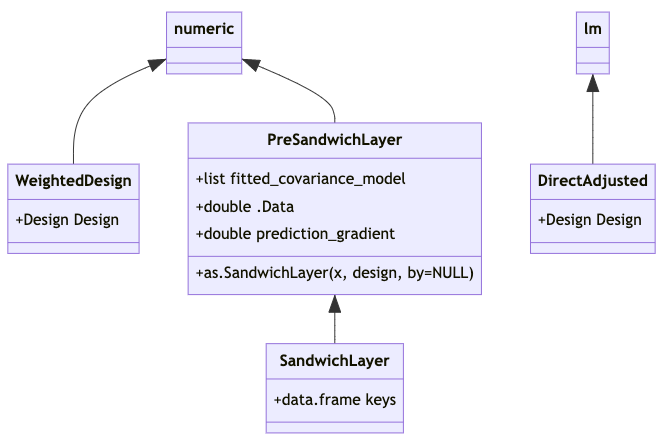

## Context

The user has specified a comparative study design and separately fitted a covariance model. E.g.:
```{r eval=FALSE}
des <- obs_design(treat ~ strata(district) + cluster(school, classroom),
                  data =Q_)
cmod <- glm(promotion ~ pretest + gender,
            family=binomial(), data = C)
```
The data frames `C` and `Q_` describe the covariance and
quasiexperimental samples, potentially at different levels of
aggregation.  For instance `C` might give student data while `Q_` is a
table of classrooms.  The samples they describe may be disjoint,
identical or overlapping.

Next she uses `lm()` (or perhaps an `lm()`-wrapper we'll offer) to
calculate directly adjusted^[Much or all of what's said here can later
be made to apply with intention-to-treat models of nearby forms, for
example `lm(promotion ~ treat + cov_adj(covmod), data=Q,
weights=ate(des))` or `lm(promotion ~ treat * cov_adj(covmod),
<...>)`. But for now our focus is covariance modeling followed by
direct adjustment, ie what's shown in the display.] estimates of an
intention-to-treat effect:

```{r eval=FALSE}
m <- lm(promotion ~ treat * gender, data = Q,
        offset = cov_adj(cmod),
        weights = ate(des))
coef(m) # spits out effect estimates
```
where `Q` may be the same as `Q_`, or `Q_` may describe aggregates of
units described in `Q`; the offset is similar to what `predict(cmod, newdata=Q, type="response")` would have given; and the weights are of the Horwitz-Thompson, inverse probability of assignment type. 

At this point `m` has class `lm`, but with
additional information tucked away in `m[['model']]`: this data frame
will have special columns `(weights)` and
`offset(cov_adj(cmod))`.  As of this writing, the flexida package implements an S4 class `WeightedDesign` that extends the base numeric vector type and encodes information beyond unit weights necessary for standard error calculations, and arranges that `m[['model']][['(weights)']]` is of this type.  This note describes two planned classes appropriate for `m[['model']][['offset(cov_adj(cmod))']]`: `SandwichLayer`, and a fallback option `PreSandwichLayer`, for use when the call to `cov_adj()` producing this object is able to locate some but not all of the necessary information. 

Standard errors will be obtained through subsequent steps, e.g. 
```{r eval=FALSE}
vcov(as.DirectAdjusted(m))
```
or
```{r eval=FALSE}
m <- as.DirectAdjusted(m,
                       by=list(cmod=c(cid1=altcid1, cid2=altcid2))
		       )
vcov(m)
```
or
```r
m <- as.DirectAdjusted(m,
                       by=<data frame with columns "cid1", "cid2">)
		       )
vcov(m)
```
Either way, once `m` has been coerced to class `DirectAdjusted`, it has acquired a `@Design` slot for the information in `des`, while `m[['model']]` will have a column `offset(cov_adj(cmod))` of class `SandwichLayer`.  Together these objects  will contain the necessary additional information to perform standard error calculations that:

- attend to the structure of the design, as recorded in `des`; and
- propagate errors from the fitting of covariance model `cmod` into standard errors reported for `treat * gender` coefficients. 


## Formal class structure proposal

<!-- couldn't get the below to render properly--> 
```{r classdiagram, eval=FALSE, echo=FALSE, fig.height=6, fig.width=6}
DiagrammeR::mermaid("
classDiagram
  numeric <|-- WeightedDesign
  numeric <|-- PreSandwichLayer
  PreSandwichLayer <|-- SandwichLayer
  lm <|-- DirectAdjusted

  PreSandwichLayer: +list fitted_covariance_model
  PreSandwichLayer: +double .Data
  PreSandwichLayer: +double prediction_gradient
  PreSandwichLayer: +as.SandwichLayer(x, design, by=NULL)

  SandwichLayer: +data.frame keys

  WeightedDesign: +Design Design
  DirectAdjusted: +Design Design
")
```
<!-- Rendering from https://mermaid.live/ --> 


Like the existing class `WeightedDesign`, the `PreSandwichLayer` and `SandwichLayer` classes extend the base numeric vector type, with numeric vectors (of predictions) in their `@.Data` slots.  `PreSandwichLayer` and `SandwichLayer` also have a `@prediction_gradient` slot, for a numeric matrix of dimension
```r
c(nrow(@.Data), length(coef(fitted_covariance_model)))
```


Regarding `as.SandwichLayer()`: Turning a `PreSandwichLayer`, `x`, into a `SandwichLayer` amounts to providing a mapping from the rows of `model.matrix(x)` or `sandwich::estfun(x)` to units of assignment recorded in `des`. This mapping is to be recorded the `@keys` data frame, with as many rows as `model.matrix(x)` and as many columns as there are unit-of-assignment (clustering) variables in a corresponding `Design`.

The mapping can be effected via `expand.model.frame(x, vars, <...>)`. If `by=NULL`, then `vars` is the vector of names of unit-of-assignment variables given in the `design`, `desvars` say. Otherwise `by` is a named character vector giving a crosswalk, the second argument to `expand.model.frame()` should be `by[desvars]`, and those names should be switched out of column names inthe data frame `expand.model.frame()` returns in favor of `desvars`. 

In order for `vcov.DirectAdjusted(m)` to work, the following functions must have methods applicable to `m@fitted_covariance_model`: `model.matrix()`, `sandwich::estfun()`, `sandwich::bread()`.  These are similar requirements to those of `sandwich::vcovHC()`. 


## Basis in known extensions of Huber-White setup to chained estimators

With reference to the formulas for stacked estimating equations of
Carroll, Ruppert, Stefanski and Crainiceanu (2006, p.373), the
covariance model has psi functions (estimating equations) $\phi(\tilde{\mathbf{Y}},
\alpha)$ with parameters $\alpha$, and Fisher information and estimating-equation covariance matrices $A_{11}$ and $B_{11}$ respectively; while the direct adjustment model's
are $\psi(\tilde{\mathbf{Y}}, \tau, \alpha)$, the `treat` coefficients
being $\tau$, with sandwich components $A_{22}$ and $B_{22}$. (The symbols "$\phi()$", "$\psi()$" and "$\alpha$" are
used as Carroll et al use them, while our "$\tau$" corresponds to
their "$\mathcal{B}$".)

We take $i$ to range over the
units of assignment (clusters) not elements^[We'll need to aggregate
(by summing) the elementwise estimating equation contributions to the
cluster level, to form cluster-wise estimating equation
contributions.].
The Carroll et al development is missing $n^{-1}$ factors at the right of
the equations defining $A_{n,\, 11}, \ldots, B_{n,\, 22}$.  To avoid ambiguities in mapping to external subroutines' understanding of "$n$"^[Carroll et al seem to have a single sample in mind,
without clusters, whereas we have both $\mathcal{C}$ and $\mathcal{Q}$,
with or without clusters. Where necessary, we use $n_\mathcal{C}$ and
$n_\mathcal{Q}$ for the unit-of-assignment counts in the two samples
respectively.], let's address the error by leaving those displays as-is,
while striking the leading $n^{-1}$ factors from display (A.34)
and from the subsequent expression for
$\mathrm{var}(\hat{\mathcal{B}})$: i.e., turn the A and B matrices
into sums not means.
Carroll et al's formulas for $A_{11}$, $A_{21}$ and
$A_{22}$ then apply, although design-based standard errors call for
different calculations of $B_{11}$, $B_{12}$ and $B_{22}$.
(When we get around to putting the multidecker sandwich together, we'll need
to be cognizant of the fact that its As and Bs are means not sums,
and ready to compensate for the fact that it will have divided by different
$ns$ in figuring the means that are $A_{11}$ and $A_{22}$, for example.) Denote the
clusters/units of assignment that are represented in covariance and
quasiexperimental samples by $\mathcal{C}$ and $\mathcal{Q}$
respectively.

## Required materials for SE calculations

To estimate variances and covariances of $\tau$, we'll need to assemble the following materials. 

1. Sufficient information about $\mathcal{C}$ and $\mathcal{Q}$ to identify their intersection $\mathcal{C}\cap\mathcal{Q}$, as is needed to estimate $B_{21}$; 
2. Matrices of estimating
functions $\{\phi(\tilde{\mathbf{Y}}_i; \hat{\alpha}): i \in \mathcal{C}\cap\mathcal{Q}\}$
and $\{\psi(\tilde{\mathbf{Y}}_i, \hat{\tau}, \hat{\alpha}): i \in \mathcal{C}\cap\mathcal{Q}\}$, as are needed for $B_{21}$; 
3. For the quasiexperimental sample $\mathcal{Q}$, matrices
$$\nabla_{\alpha} \{\sum_{j \in i}\psi(\tilde{\mathbf{Y}}_j, \hat{\tau}, {\alpha}):
i \in \mathcal{Q}\} \vert_{\alpha=\hat\alpha},$$ corresponding to
$A_{21}$, where "$j \in i$" means "elements $j$ of cluster $i$" and "$\sum_{j \in i} \psi(\tilde{\mathbf{Y}}_j, \hat{\tau}, {\alpha})$" is interpreted to mean "$\psi(\tilde{\mathbf{Y}}_i, \hat{\tau}, {\alpha})$" if there is no clustering;
4. Estimates of the direct adjustment model's "bread matrix" $(n_\mathcal{Q}^{-1} A_{22})^{-1} =
\{\frac{1}{\# \mathcal{Q}}\nabla_\tau \sum_{i \in \mathcal{Q}}
\mathbb{E}[\psi(\tilde{\mathbf{Y}}_i, \tau, \hat{\alpha})]
\vert_{\tau=\hat\tau}\}^{-1}$, i.e. the inverse of its Fisher information
w.r.t. $\tau$ only, along with the "meat matrix" 
$n_\mathcal{Q}^{-1} B_{22} = n_\mathcal{Q}^{-1}
\mathrm{Cov}[\sum_{i \in \mathcal{Q}} \psi(\tilde{\mathbf{Y}}_i,
{\tau}, {\alpha})]_{({\tau}, {\alpha})=(\hat{\tau}, \hat{\alpha})}$;
5. The covariance model's bread matrix $(n_\mathcal{C}^{-1} \hat{A}_{11})^{-1} = 
\{n_\mathcal{C}^{-1}\sum_{i \in \mathcal{C}}
\nabla_\alpha [\phi(\tilde{\mathbf{Y}}_i;
{\alpha})]_{\alpha=\hat\alpha}\}^{-1}$; and
6. for covariance estimation in the conventional "model-based" setup
only, estimates of the covariance model's B matrix $n_\mathcal{C}^{-1}B_{11} =
n_\mathcal{C}^{-1}
\mathrm{Cov}[\sum_{i \in \mathcal{C}}\phi(\tilde{\mathbf{Y}}_i;
{\alpha})]_{\alpha=\hat\alpha}$ (a "clustered" covariance estimate).

In (5), observed information $n_\mathcal{C}^{-1}\sum_{i \in \mathcal{C}}
\nabla_\alpha [\phi(\tilde{\mathbf{Y}}_i;
{\alpha})]_{\alpha=\hat\alpha}$ is preferred to "observed expected"
information, $n_\mathcal{C}^{-1}\sum_{i \in \mathcal{C}} \nabla_\alpha \mathbb{E}
[\phi(\tilde{\mathbf{Y}}_i; {\alpha})]_{\alpha=\hat\alpha}$, because
observed information is agnostic as to whether expectation is
calculated with conditioning on potential outcomes, ie the finite
population perspective, or with conditioning on treatment assignment,
the model based perspective. In the special case of quantile regression^[Strictly speaking, the estimating equations of a quantile regression aren't differentiable in $\alpha$. All directional derivatives will exist, and I'm expecting this to be enough for our purposes, but I haven't thought it through.], observed information isn't ordinarily used in standard error calculations, and it may take some doing to get.

Regarding (6), $B_{11}$ is not needed for design-based standard
errors, as in this setting observations outside of the
quasiexperimental sample do not contribute to the covariance model's B
matrix.  Only quasiexperimental sample observations do, and we'll have
access to these when the direct adjustment model is fit. As we also
have $\{\phi(\tilde{\mathbf{Y}}_i; \hat{\alpha}): i \in \mathcal{Q}\}$
and $\{\psi(\tilde{\mathbf{Y}}_i, \hat{\tau}, \hat{\alpha}): i \in
\mathcal{Q}\}$, we can use these materials to estimate $B_{12}$ and
$B_{22}$.

## Software implementation comments on 1--6 above, including contents of {`Sandwich`/`Vegan`}{`Layer`/`LayerKit`} objects


1\. A `SandwichLayer` object `l` carries a `keys` data frame with which to identify rows of `model.matrix(l)` with units of assignment (as named in a separate Design object).  The association can be many-one (but not one-many); it is not required that named units appear in the design. As `covmod` itself won't be aware of these cluster associations, assembling this info at runtime calls for trickery, as well as a means for users to override the trickery and directly provide key variables that the design will need. An NA in `keys` indicates a unit not appearing in the Design.

2\.  Estimating functions may need to be aggregated (summed) to the cluster level before calculation of $B_{21}$.  There should be a dedicated function to calculate $B_{21}$ from the cluster-aggregated estimating function matrices. 

3\. `PreSandwichLayer` and `SandwichLayer` have an `@prediction_gradient` slot for a numeric matrix.  This matrix has as many rows as there are entries in the `.Data` vector, and as many columns as there are estimating equations.

The `@prediction_gradient` slot carries $\{\nabla_\alpha f_{\alpha}(\tilde{\mathbf{Y}}_j)|_\alpha=\hat\alpha\}$, where $j$ ranges over rows of `Q` as above -- elements not clusters where the distinction exists -- and $f_\alpha(\mathbf{Y})$ represents the prediction for data $\mathbf{Y}$ from a fitted model of `class(cov_mod)` with parameters $\alpha$. For $\psi()$'s that use only "predictions" of the covariance model, as ours does, the first derivative of the covariance model predictions as applied to data in $\mathcal{Q}$ will provide sufficient information from the covariance model to complete the calculation of $\{\nabla_{\alpha}  \psi(\tilde{\mathbf{Y}}_i, \hat{\tau}, {\alpha}) \vert_{\alpha=\hat\alpha}: i \in \mathcal{Q}\}$. 

For `glm` and similarly typed objects `cmod`, such predictions are a joint function of `family(cmod)` and the `model.matrix` generated in the process of creating predictions from `cmod`. 

4\. The `SandwichLayer` class isn't implicated in (4).  We can take extant calculations of a direct adjustment model's information matrix, with the proviso that we keep track of whatever scaling those calculations may have applied. For design-based SEs we'll need our own B matrix calculation.  For model-based SEs we can plug in to extant routines for $B_{22}$ also, but being careful ensure clustering on the units of assignment (as named in a Design object). Scaling of these matrices should default to the conventions of the sandwich package. (I haven't considered whether use of HC0--3 etc for $B_{22}$ calls for corresponding adjustment to estimation of $B_{21}$ and/or $B_{11}$, nor whether heuristics animating these adjustments make sense in this context.)

5\. `sandwich::bread()` will be used to retrieve $A_{11}^{-1}$.

We can take extant calculations of a covariance model's information matrix, defaulting to scaling conventions implemented in the sandwich package. 

6\. `sandwich::meatCL()` will be used to retrieve $B_{11}$.  For now we only try to implement HC0 & HC1.   (I haven't considered whether use of HC0--3 etc for $B_{11}$ calls for corresponding adjustment to estimation of $B_{21}$ and/or $B_{22}$, nor whether heuristics animating these adjustments make sense in this context.)

## References
